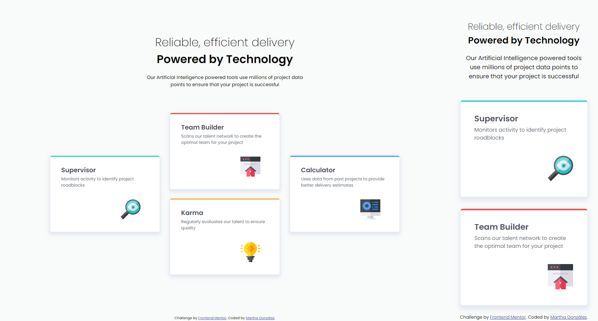

# Frontend Mentor - Four card feature section solution

This is a solution to the [Four card feature section challenge on Frontend Mentor](https://www.frontendmentor.io/challenges/four-card-feature-section-weK1eFYK). Frontend Mentor challenges help you improve your coding skills by building realistic projects. 

## Table of contents

- [Overview](#overview)
  - [The challenge](#the-challenge)
  - [Screenshot](#screenshot)
  - [Links](#links)
- [My process](#my-process)
  - [Built with](#built-with)
  - [What I learned](#what-i-learned)
  - [Continued development](#continued-development)
  - [Useful resources](#useful-resources)
- [Author](#author)
- [Acknowledgments](#acknowledgments)

## Overview

### The challenge

Users should be able to:

- View the optimal layout for the site depending on their device's screen size

### Screenshot

- Left side: Desktop (1440px width)
- Right side: Mobile (375px width)

### Links

- Solution URL: [Repository](https://github.com/margga88/four-card-feature-section)
- Live Site URL: [Here](https://margga88.github.io/four-card-feature-section/)

## My process

### Built with

- Semantic HTML5 markup
- CSS custom properties
- Flexbox
- CSS Grid
- Mobile-first workflow
- CUBE CSS methodology

### What I learned

- This was one complicated challenge for me since I was rusty with the grid. It made me go through some old notes and articles to reinforce or "make resurface" the grid knowledge. I'm actually impressed I came up with a soluton faster than I thought.

- This was also that challenge that made me deal with the differences within resolutions when the containers are grid-based, and probably why percentages sometimes can get tricky when applied to container widths. Nevertheless, this was one great experience that makes dive a bit more into grids.

### Continued development

I really hope to do more projects where grid is applied, so I can improve my skills on that.

### Useful resources

- [An Interactive Guide to CSS Grid • Josh W. Comeau](https://www.joshwcomeau.com/css/interactive-guide-to-grid/) - This was such a good resource for when I got stuck thinking about how to even start working with the grid.
- [Basic concepts of grid layout - CSS | MDN](https://developer.mozilla.org/en-US/docs/Web/CSS/CSS_grid_layout/Basic_concepts_of_grid_layout) - Great for quick checks on the grid interrogants.

## Author

- Frontend Mentor - [@margga88](https://www.frontendmentor.io/profile/margga88)

## Acknowledgments

To Frontend Mentor for challenges like this one.
